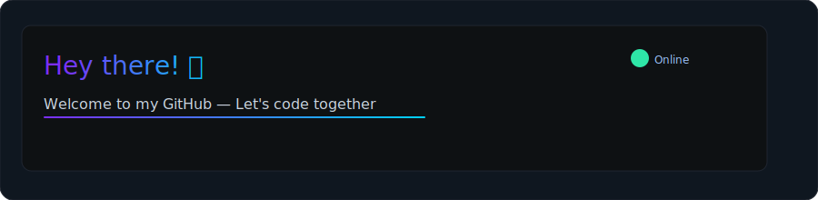

# Salut — je suis Zava07 👋

<!-- Hero animé (SVG) -->

Bienvenue sur mon profil GitHub ! Ici tu trouveras mes projets, technologies et une démo interactive hébergée via GitHub Pages.

À propos
- Passionné par le code, le design et les animations.
- J’aime rendre les choses jolies et dynamiques ✨

Tech utilisées
- Ci‑dessous des badges pour les techs que j’utilise (remplace-les par tes tech réelles si besoin).

Mes stats

Démonstration interactive
- Pour voir des animations interactives (Lottie, Three.js, canvas), active GitHub Pages (branche main, root) et ouvre la page index.html fournie.
- Demo link (après activation Pages) : https://Zava07.github.io/Zava07

Comment personnaliser rapidement
- Pour modifier la liste des tech : remplace les badges ci‑dessous par ceux de ton choix (ou donne‑moi la liste et je le fais pour toi).
- Pour modifier les couleurs : édite assets/hero.svg (couleurs CSS) et index.html (thème).

Commandes Git (si tu travailles local)
- git clone git@github.com:Zava07/Zava07.git
- cd Zava07
- git add .
- git commit -m "Profile: update README + Pages demo"
- git push

Remarque importante
- Le README supporte les images (GIF/SVG animés), mais pas le JavaScript. Pour JS et interactions, utilise GitHub Pages (index.html).

Tu veux que j’insère directement ta liste exacte de tech ? Envoie-la (par ex. "React, Node.js, Express, MongoDB, TypeScript") ou partage le lien du repo et je mets tout à jour.